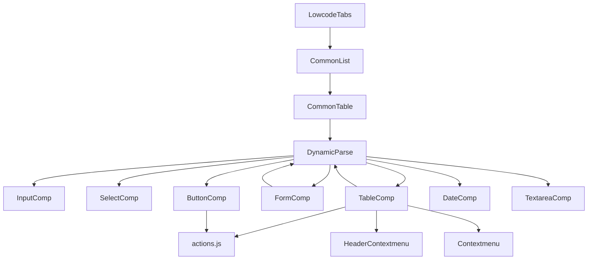

# 低代码组件分析指南

## 1. 概述

本文档对 `src/components/LowCodeComponents` 和 `src/components/LowcodeTabs` 进行全面分析，包括组件结构、功能特性、依赖关系以及未来开发考虑事项。本分析旨在帮助团队成员和AI模型理解现有实现，并为未来的开发工作提供参考。

**版权归属domiyoung__**

## 2. 组件架构概览

### 2.1 LowCodeComponents

`LowCodeComponents` 是一套低代码组件库，用于动态渲染和处理表单、表格等UI元素，支持通过配置生成复杂的业务界面。该组件库采用动态组件加载机制，实现了配置驱动的界面渲染。

#### 目录结构

```
LowCodeComponents/
├── FormulaEditor/       # 公式编辑器相关组件
├── Table/               # 表格相关组件
├── ButtonComp.vue       # 按钮组件
├── DateComp.vue         # 日期组件
├── DynamicParse.vue     # 动态组件解析器(核心)
├── FormComp.vue         # 表单组件
├── FormMixins.js        # 表单混入
├── FormulaComp.vue      # 公式组件
├── InputComp.vue        # 输入框组件
├── ReferenceFormSelect.vue # 引用选择
├── SelectComp.vue       # 下拉选择组件
├── TableComp.vue        # 表格组件
├── TableSearch.vue      # 表格搜索组件
├── Tabs.vue             # 标签页组件
├── TextareaComp.vue     # 文本域组件
├── actions.js           # 动作处理(核心)
└── pageRender.vue       # 页面渲染器
```

### 2.2 LowcodeTabs

`LowcodeTabs` 是基于低代码理念构建的标签页组件，用于在一个页面中展示多个相关数据列表，每个标签页可以独立配置查询条件和展示内容。该组件实现了参数动态解析和转换功能。

#### 目录结构

```
LowcodeTabs/
└── index.vue        # 标签页组件实现
```

## 3. 核心组件实现原理

### 3.1 DynamicParse.vue

**功能描述**: 动态组件解析器，是低代码组件库的核心，负责根据配置动态加载不同类型的组件。

**实现原理**:
DynamicParse 组件使用了 Vue 的动态组件加载机制，通过 `import()` 函数实现按需加载。它接收一个 `componentType` 参数，将其转换为实际组件名称，然后动态导入并渲染该组件。

**核心代码**:
```javascript
async loadComponent() {
  // 异步加载组件
  const component = await import(`@/components/LowCodeComponents/${this.compValue}.vue`)
  // 将组件注册为局部组件
  this.loadedComponent = component.default || component
}
```

**数据流程**:
1. 父组件传入 `componentType` 属性
2. `compValue` 计算属性将类型名转换为组件名（例如 "input" -> "InputComp"）
3. `mounted` 生命周期调用 `loadComponent` 方法异步加载组件
4. 加载完成后，通过 `<component :is="loadedComponent">` 渲染组件
5. 使用 `v-bind="$attrs"` 和 `v-on="$listeners"` 透传所有属性和事件给子组件

**技术难点**:
- 动态组件加载时的错误处理
- 确保异步加载完成前的界面状态处理
- 不同组件属性和事件的统一透传

### 3.2 FormComp.vue

**功能描述**: 表单组件，用于渲染低代码表单，支持各种输入控件。

**实现原理**:
FormComp 组件基于 Element UI 的 el-form 构建，使用 DynamicParse 动态渲染不同类型的表单项。通过配置化方式定义表单结构和验证规则，并处理表单数据的双向绑定。

**数据流程**:
1. 接收 `value` 属性作为表单数据源
2. 接收 `itemList` 属性（通过 $attrs 传递）定义表单结构
3. 遍历 `formItemList` 渲染表单项，每个项使用 DynamicParse 组件
4. 表单项值变更时触发 `handleInput` 方法
5. 通过 `$emit('input', newValue)` 实现双向绑定
6. 使用 Vue 的依赖注入获取 `vo_info` 上下文数据

**关键实现细节**:
- 表单验证通过 el-form 的 rules 属性实现
- 表单项布局使用 el-row 和 el-col 实现响应式布局
- 支持自定义表单项的样式和布局（通过 `block` 属性）
- 处理明细行的添加和删除，通过 `handleAddItems` 和 `handleDeleteItems` 方法

### 3.3 TableComp.vue

**功能描述**: 表格组件，用于展示数据列表，支持各种数据操作。

**实现原理**:
TableComp 基于 Element UI 的 el-table 构建，实现了复杂的表格功能，包括数据展示、编辑、过滤、排序等。表格的列和操作按钮通过配置生成，支持单元格内容的动态渲染。

**数据流程**:
1. 接收 `originValue` 属性作为数据源
2. 从 `$attrs.item` 获取表格配置，包括字段列表、操作按钮等
3. 在 `mounted` 生命周期中初始化本地数据 `localList`
4. 监听 `list` 变化，同步更新 `localList`
5. 行操作（如点击、右键）触发相应事件，通过 actions.js 处理

**关键功能实现**:
- **动态列渲染**: 根据 `fieldList` 配置动态生成表格列
- **单元格内容渲染**: 使用 `slot-scope` 和条件渲染实现不同类型内容的展示
- **右键菜单**: 使用 Contextmenu 组件实现自定义右键菜单
- **表格内编辑**: 通过 DynamicParse 组件实现单元格内编辑功能
- **表头自定义**: 使用 render 函数实现自定义表头渲染
- **数据操作**: 通过 actions.js 中定义的方法处理增删改查操作

**技术难点**:
- 复杂表格配置的解析和应用
- 表格内编辑状态的管理
- 性能优化，特别是大数据量时的渲染性能
- 右键菜单和表头自定义渲染

### 3.4 actions.js

**功能描述**: 定义低代码组件的通用操作行为，如添加、删除、导出等。

**实现原理**:
actions.js 定义了一系列函数，每个函数处理特定的操作行为。这些函数通过 this 上下文访问组件实例，实现对数据和 UI 的操作。这种设计模式将业务逻辑与 UI 组件分离，提高了代码复用性。

**数据流程**:
1. 组件中引入 actions.js
2. 通过 `actions[actionType].bind(this)` 绑定上下文
3. 调用操作函数处理业务逻辑
4. 函数内部通过 this 访问组件状态和方法

**关键实现细节**:
- **addRow**: 通过 `$emit('add-items', { row, key })` 触发父组件处理新增行
- **formTopDelete**: 删除表单中的行数据，并通过 `$emit('delete-items', ...)` 通知父组件
- **link**: 处理页面跳转逻辑，支持内部和外部链接
- **export**: 调用 API 服务导出数据，并处理二进制响应
- **listDel**: 实现列表数据删除，包括确认弹窗和 API 调用
- **openVo**: 打开视图对象，显示详情弹窗

### 3.5 LowcodeTabs/index.vue

**功能描述**: 低代码标签页组件，用于在一个页面展示多个相关的数据列表。

**实现原理**:
LowcodeTabs 基于 Element UI 的 el-tabs 构建，实现了多标签页的动态加载和参数转换。每个标签页内嵌一个 CommonList 组件，用于显示列表数据。

**数据流程**:
1. 接收 `list` 属性定义标签页配置
2. 根据 `list[0].queryCode` 初始化 `activeName`
3. 标签页切换时，加载对应标签页的 CommonList 组件
4. 每个标签页通过 `convertParams` 方法处理查询参数
5. 参数处理结果传递给 CommonList 组件的 `tabs-query` 属性

**核心参数处理逻辑**:
```javascript
convertParams(item) {
  const paramsStr = item.parametricRule
  const params = paramsStr && typeof paramsStr === 'string' ? eval('(' + paramsStr + ')') : {}
  const curKey = item.queryCode
  const APIPARAMS = Object.assign({}, params)
  
  // 处理参数存储和缓存
  if (!(curKey in this.tabsConfig)) {
    this.tabsConfig[curKey] = {}
  }

  // 处理每个参数
  for (const key in params) {
    if (!(key in this.tabsConfig[curKey])) {
      this.tabsConfig[curKey][key] = params[key]
    }
    // 参数值转换处理
    this.convertConfigvalToValue({ source: params, result: APIPARAMS, key, val: this.tabsConfig[curKey][key] })
  }
  
  this.tabsConfig[curKey] = APIPARAMS
  return this.tabsConfig[curKey]
}
```

**关键实现细节**:
- 使用 `keep-alive` 保持标签页状态，避免重复加载
- 条件渲染确保只有激活的标签页内容被加载
- 参数转换支持固定值和动态计算的值
- 支持从路由、表单实例等多种来源获取参数值
- 使用 `tabsConfig` 缓存参数，避免重复处理

## 4. 数据依赖与流向分析

### 4.1 组件依赖关系



### 4.2 数据流向

#### 表单数据流

```
父组件 --> FormComp.props.value --> 
FormComp内部渲染 --> 
各表单项组件 --> 
用户输入事件 --> 
handleInput --> 
$emit('input') --> 
父组件数据更新
```

#### 表格数据流

```
父组件 --> TableComp.props.originValue --> 
TableComp.localList --> 
表格渲染 --> 
用户操作(编辑/删除) --> 
actions.js处理 --> 
$emit事件 --> 
父组件数据更新
```

#### 标签页数据流

```
父组件 --> LowcodeTabs.props.list --> 
标签页渲染 --> 
用户切换标签 --> 
activeName更新 --> 
对应CommonList组件加载 --> 
convertParams处理参数 --> 
CommonList接收参数并加载数据
```

### 4.3 核心依赖项

#### 低代码组件的外部依赖

1. **Element UI**
   - 提供基础UI组件：表单、表格、弹窗、按钮等
   - 版本要求: 2.x
   - 影响范围: 所有UI组件的外观和交互行为

2. **Vue.js**
   - 提供组件系统、响应式数据和事件机制
   - 版本要求: 2.x
   - 影响范围: 所有组件的基础功能和生命周期

3. **Lodash**
   - 提供深拷贝、数组处理等工具函数
   - 主要使用: cloneDeep, isArray 等方法
   - 影响范围: 数据处理逻辑

4. **API 服务**
   - commonPage/lowcode.js: 低代码核心API
   - commonPage/common.js: 通用API
   - commonPage/commonList.js: 列表相关API
   - commonPage/commonForm.js: 表单相关API
   - 影响范围: 数据获取和提交

#### 低代码组件的内部依赖

1. **配置数据**
   - 来源: mock数据或后端API
   - 包含: 表单结构、表格列定义、操作按钮、验证规则等
   - 影响范围: 组件的渲染结果和交互行为

2. **动态解析引擎**
   - DynamicParse.vue: 负责组件的动态加载和渲染
   - 影响范围: 所有低代码组件的动态特性

3. **状态管理**
   - 主要依赖Vue的props/events机制
   - 部分组件使用 provide/inject 进行深层次数据传递
   - 影响范围: 组件树中的数据同步和更新

## 5. 使用示例与场景

### 5.1 LowcodeTabs 使用示例

```vue
<LowcodeTabs
  :list="detailTabsList"
  :module-prop="module"
  :detail-data="formValue"
  :is-show-search-btn-details-by-tabs="isShowSearchBtnDetailsByTabs"
/>
```

其中 `list` 结构示例:
```javascript
[
  {
    tabName: '标签1',
    queryCode: 'code1',
    parametricRule: '{param1: "value1", param2: "$this.formValue.field"}'
  },
  {
    tabName: '标签2',
    queryCode: 'code2',
    parametricRule: '{param1: "value2", param2: "$this.route.query.id"}'
  }
]
```

**应用场景**:
- 详情页面中展示多个相关数据列表（如订单和订单项）
- 不同筛选条件下的数据视图切换（如待审批、已审批、已驳回）
- 多维度数据展示（如按日期、按产品、按客户分类的数据）

### 5.2 低代码表单示例

```vue
<FormComp
  v-model="formData"
  :itemList="[
    {
      key: 'name',
      label: '姓名',
      type: 'input',
      rules: [{ required: true, message: '必填项' }]
    },
    {
      key: 'gender',
      label: '性别',
      type: 'select',
      options: [
        { value: 'male', label: '男' },
        { value: 'female', label: '女' }
      ]
    }
  ]"
  @submit="handleSubmit"
/>
```

**应用场景**:
- 动态表单生成（如配置化的搜索条件）
- 复杂业务表单（如订单录入、资料维护）
- 审批流程表单（如审批意见、流程流转）

### 5.3 低代码表格示例

```vue
<TableComp
  :originValue="tableData"
  :isEditTypeTable="true"
  :item="{
    field_list: fieldList,
    top_op_actions: topActions,
    right_op_actions: rightActions
  }"
  @getEditList="handleEdit"
  @getDelList="handleDelete"
/>
```

**应用场景**:
- 数据列表展示与管理
- 内嵌编辑表格（如批量编辑）
- 复杂业务表格（如库存管理、订单管理）

## 6. 技术特点与实现机制

### 6.1 设计模式与技术选型

1. **工厂模式**
   - `DynamicParse.vue` 作为组件工厂，根据类型创建不同组件
   - 实现机制: 动态 import + 组件注册

2. **组合模式**
   - 通过组件组合构建复杂UI
   - 实现机制: Vue 组件嵌套 + 属性透传

3. **观察者模式**
   - 使用 Vue 的事件系统实现组件间通信
   - 实现机制: $emit/$on + 事件回调

4. **策略模式**
   - `actions.js` 中不同操作类型对应不同处理函数
   - 实现机制: 函数映射表 + 上下文绑定

### 6.2 核心技术实现

1. **动态组件加载**
   ```javascript
   // 动态导入组件
   const component = await import(`@/components/LowCodeComponents/${compName}.vue`)
   // 动态渲染
   <component :is="loadedComponent" v-bind="$attrs" v-on="$listeners" />
   ```

2. **参数表达式解析**
   ```javascript
   // 解析字符串表达式为对象
   const params = paramsStr && typeof paramsStr === 'string' ? eval('(' + paramsStr + ')') : {}
   
   // 处理动态参数
   if (val.startsWith('$this.route')) {
     const childKey = val.replace('$this.route.', '')
     result[key] = this.$route.query[childKey]
   } else if (val.startsWith('$this.')) {
     const trueValue = eval(optionsChain(val.replace('$this.', 'this.')))
     result[key] = trueValue
   }
   ```

3. **表格单元格动态渲染**
   ```vue
   <template slot-scope="scope">
     <template v-if="item.field_input_type==='text'">
       <!-- 文本类型展示 -->
     </template>
     <DynamicParse
       v-else
       :component-type="item.field_input_type"
       :item="processedItem(scope.row, item)"
       @input="handleInput($event, item, scope, tableKey)"
     />
   </template>
   ```

4. **统一事件处理**
   ```javascript
   // 在TableComp.vue中
   handleRightClick(event, params) {
     const { action_type } = params
     let n_action_type = action_type === 'delete' ? type() > 0 ? 'formDel' : 'listDel' : action_type
     const action = actions[n_action_type].bind(this)
     action(params, this.activeTableRow)
   }
   ```

### 6.3 优化空间与技术风险

1. **安全性风险**
   - 使用 `eval()` 解析参数存在安全风险
   - 风险等级: 高
   - 解决方案: 使用 Function 构造函数或 JSON.parse 替代

2. **错误处理不足**
   - 缺乏全面的错误处理机制
   - 风险等级: 中
   - 解决方案: 添加 try/catch 和全局错误处理

3. **类型安全问题**
   - 缺少类型定义和严格的类型检查
   - 风险等级: 中
   - 解决方案: 引入 TypeScript 或 PropTypes

4. **性能问题**
   - 大量动态组件加载可能导致性能问题
   - 风险等级: 中
   - 解决方案: 组件预加载和缓存、Code Splitting

## 7. 未来开发建议

### 7.1 代码优化

1. **替换 eval()**
   ```javascript
   // 替代方案1: Function构造函数
   const parseParams = (str) => {
     try {
       return (new Function(`return ${str}`))();
     } catch (e) {
       console.error('Invalid param string:', str);
       return {};
     }
   }
   
   // 替代方案2: JSON.parse (仅适用于JSON格式)
   const parseJsonParams = (str) => {
     try {
       return JSON.parse(str);
     } catch (e) {
       console.error('Invalid JSON string:', str);
       return {};
     }
   }
   ```

2. **增加 TypeScript 支持**
   ```typescript
   // 定义组件Props接口
   interface DynamicParseProps {
     componentType: string;
     value?: any;
     item?: Record<string, any>;
   }
   
   // 组件类型定义
   const components: Record<string, Component> = {
     InputComp,
     SelectComp,
     ButtonComp,
     // ...
   }
   ```

3. **优化异步加载**
   ```javascript
   // 组件缓存机制
   const componentCache = {};
   
   async loadComponent() {
     const { componentType } = this;
     const cacheKey = `${componentType}Comp`;
     
     if (componentCache[cacheKey]) {
       this.loadedComponent = componentCache[cacheKey];
       return;
     }
     
     try {
       const component = await import(`@/components/LowCodeComponents/${this.compValue}.vue`);
       componentCache[cacheKey] = component.default || component;
       this.loadedComponent = componentCache[cacheKey];
     } catch (error) {
       console.error(`Failed to load component: ${this.compValue}`, error);
       // 加载失败处理
     }
   }
   ```

### 7.2 功能扩展

1. **更多组件类型**
   - 丰富表单组件: 级联选择器、上传组件、富文本编辑器
   - 数据可视化组件: 图表、仪表盘、数据网格
   - 业务组件: 地址选择器、审批流程图、流程设计器

2. **自定义主题支持**
   ```scss
   // 主题变量定义
   $primary-color: var(--primary-color, #409EFF);
   $success-color: var(--success-color, #67C23A);
   $warning-color: var(--warning-color, #E6A23C);
   $danger-color: var(--danger-color, #F56C6C);
   
   // 组件样式使用变量
   .custom-button {
     background-color: $primary-color;
     &.success {
       background-color: $success-color;
     }
   }
   ```

3. **移动端适配**
   ```vue
   <template>
     <div :class="['form-container', {'mobile-form': isMobile}]">
       <!-- 响应式布局 -->
       <el-row :gutter="isMobile ? 0 : 20">
         <el-col :span="isMobile ? 24 : 12">
           <!-- 表单内容 -->
         </el-col>
       </el-row>
     </div>
   </template>
   
   <script>
   export default {
     computed: {
       isMobile() {
         return window.innerWidth < 768;
       }
     }
   }
   </script>
   ```

### 7.3 架构优化

1. **模块化重构**
   - 将大型组件拆分为更小的功能模块
   - 使用 Vue 3 的 Composition API 提取可复用逻辑
   - 实现更清晰的关注点分离

2. **状态管理优化**
   - 引入 Vuex 管理全局状态
   - 将配置数据、表单状态等集中管理
   - 实现更可预测的数据流

3. **API 层抽象**
   - 统一 API 调用层
   - 将 API 请求与响应处理解耦
   - 支持请求拦截、响应转换和错误处理

## 8. 附录

### 8.1 核心 API 接口定义

**DynamicParse Props**:
```typescript
interface DynamicParseProps {
  componentType: string;  // 组件类型，如 'input', 'select'
  [key: string]: any;     // 其他透传属性
}
```

**FormComp Props**:
```typescript
interface FormCompProps {
  value: Record<string, any>;  // 表单数据对象
  // itemList 通过 $attrs 传递
}

interface FormItem {
  key: string;            // 表单项标识
  label: string;          // 表单项标签
  type: string;           // 表单项类型
  span?: number;          // 栅格宽度
  block?: boolean;        // 是否独占一行
  rules?: Array<Rule>;    // 验证规则
  [key: string]: any;     // 其他属性
}
```

**TableComp Props**:
```typescript
interface TableCompProps {
  originValue: Array<any>;       // 数据源初始值
  isEditTypeTable?: boolean;     // 是否可编辑表格
  isForm?: boolean;              // 是否作为表单的一部分
  total?: number;                // 总记录数
  listLoading?: boolean;         // 加载状态
  globalBtnDisable?: boolean;    // 全局禁用操作
}

interface TableConfig {
  field_list: Array<FieldConfig>;           // 字段配置
  top_op_actions?: Array<ActionConfig>;     // 顶部操作按钮
  right_op_actions?: Array<ActionConfig>;   // 右键菜单操作
  table_actions?: Array<ActionConfig>;      // 表格行操作
  page_size?: number;                       // 每页记录数
  height?: string | number;                 // 表格高度
}
```

**LowcodeTabs Props**:
```typescript
interface LowcodeTabsProps {
  list: Array<TabConfig>;    // 标签页配置列表
  moduleProp?: string;       // 模块名称
  detailData: Record<string, any>;  // 详情数据
  isShowSearchBtnDetailsByTabs?: boolean;  // 是否显示搜索按钮
}

interface TabConfig {
  tabName: string;           // 标签页名称
  queryCode: string;         // 查询代码
  parametricRule?: string;   // 参数规则
}
```

### 8.2 配置项示例

**完整表单配置示例**:
```javascript
{
  // 表单基本配置
  inline: false,
  labelPosition: 'right',
  labelWidth: '120px',
  size: 'small',
  
  // 表单项配置
  formItemList: [
    {
      key: 'name',
      label: '姓名',
      type: 'input',
      span: 12,
      rules: [
        { required: true, message: '请输入姓名', trigger: 'blur' },
        { min: 2, max: 20, message: '长度在 2 到 20 个字符', trigger: 'blur' }
      ]
    },
    {
      key: 'gender',
      label: '性别',
      type: 'select',
      span: 12,
      dataSourceCode: 'gender_options',
      rules: [{ required: true, message: '请选择性别', trigger: 'change' }]
    },
    {
      key: 'birthday',
      label: '出生日期',
      type: 'date',
      span: 12
    },
    {
      key: 'address',
      label: '地址',
      type: 'textarea',
      span: 24,
      block: true
    }
  ]
}
```

**完整表格配置示例**:
```javascript
{
  // 字段列表配置
  field_list: [
    {
      field_code: 'id',
      field_name: 'ID',
      field_input_type: 'text',
      field_value_type: 'string',
      is_show: true,
      freeze_type: true,  // 冻结列
      field_width: 80,
      is_sort: 1,         // 支持排序
      text_align: 'center'
    },
    {
      field_code: 'name',
      field_name: '名称',
      field_input_type: 'text',
      field_value_type: 'string',
      is_show: true,
      field_width: 120,
      show_tooltip: 1     // 显示tooltip
    },
    {
      field_code: 'status',
      field_name: '状态',
      field_input_type: 'text',
      field_type: 'statusTag',
      field_value_type: 'string',
      is_show: true,
      field_width: 100,
      memo: '{"tagStyle": "status_style", "tagName": "status_text"}'
    },
    {
      field_code: 'price',
      field_name: '价格',
      field_input_type: 'input',
      field_value_type: 'number',
      is_show: true,
      field_width: 100
    }
  ],
  
  // 顶部操作按钮
  top_op_actions: [
    {
      name: '新增',
      key: 'add',
      action_type: 'addRow',
      type: 'primary',
      icon: 'el-icon-plus'
    },
    {
      name: '导出',
      key: 'export',
      action_type: 'export',
      type: 'success',
      icon: 'el-icon-download'
    }
  ],
  
  // 右键菜单操作
  right_op_actions: [
    {
      name: '编辑',
      key: 'edit',
      action_type: 'edit',
      icon: 'el-icon-edit'
    },
    {
      name: '删除',
      key: 'delete',
      action_type: 'delete',
      icon: 'el-icon-delete',
      physicalDel: false  // 逻辑删除
    },
    {
      name: '查看日志',
      key: 'log',
      action_type: 'openLog',
      icon: 'el-icon-document',
      log_config: {
        log_id: 'id',
        log_type: 'table_log',
        show_type: 'dialog'
      }
    }
  ],
  
  // 表格行操作
  table_actions: [
    {
      op_type: 'rowClick',
      action_type: 'view',
      limit_options: []
    }
  ],
  
  // 其他配置
  page_size: 20,
  height: '400px'
}
```

**版权归属domiyoung__** 